# なぜこのビジネスを
# 志すのか

### N. M.

---

# 私のプロフィール

---

## 家族とバスケットボール

- 自分がバスケットボールを始めたきっかけ
    - バスケットボールで国体に出場した祖父
    - 母が漫画『スラムダンク』のファン
- バスケットボールへの個人的な思い入れ
    - 妻はバスケットボール仲間だった

---

## 過去～将来の職業選択理由

- わくわくするものを生み出したい
    - 人の心を豊かに　⇒　より良い社会へ
    - 科学的に感性を刺激する
- 持論：『感動の入力は五感』
    - 五感に訴えるサービスを作りたい

---

# 以下、本題

---

## 『スポーツ × データ』ビジネス
## を志す理由

1. 興味を抱いたきっかけ
2. 熱意
3. スキルフィット

---

## 1. 興味を抱いたきっかけ

---

## テニスのテレビ放送

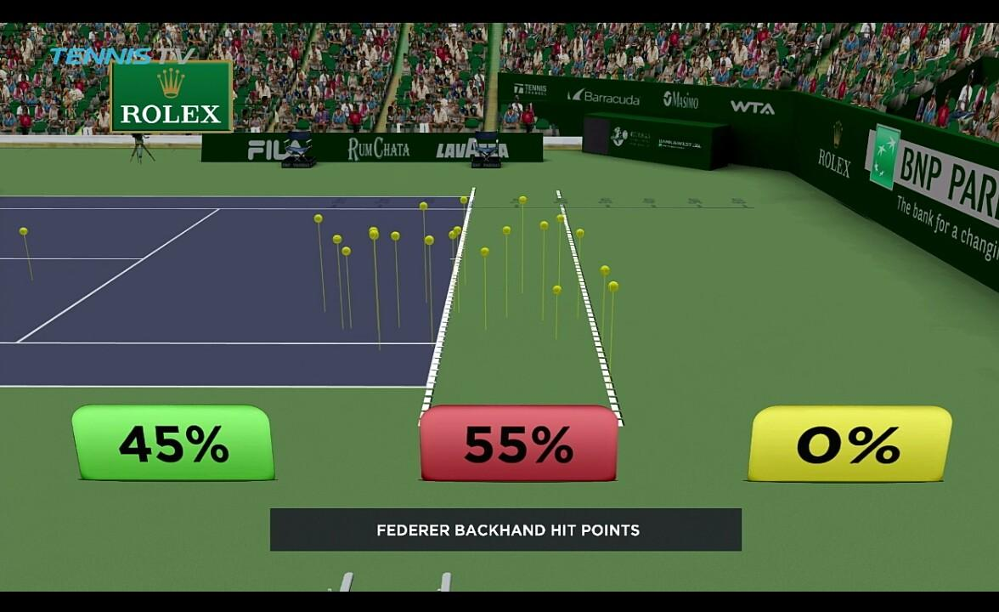
 

- フェデラー選手のライジング率が異常に高い 　　⇒ 『主導権』の要因可視化が衝撃的
- 柔道やバレーの放送でも分析が積極化 　　⇒　魅力向上に大きく寄与

---

## 魅力的なアプリとの出会い

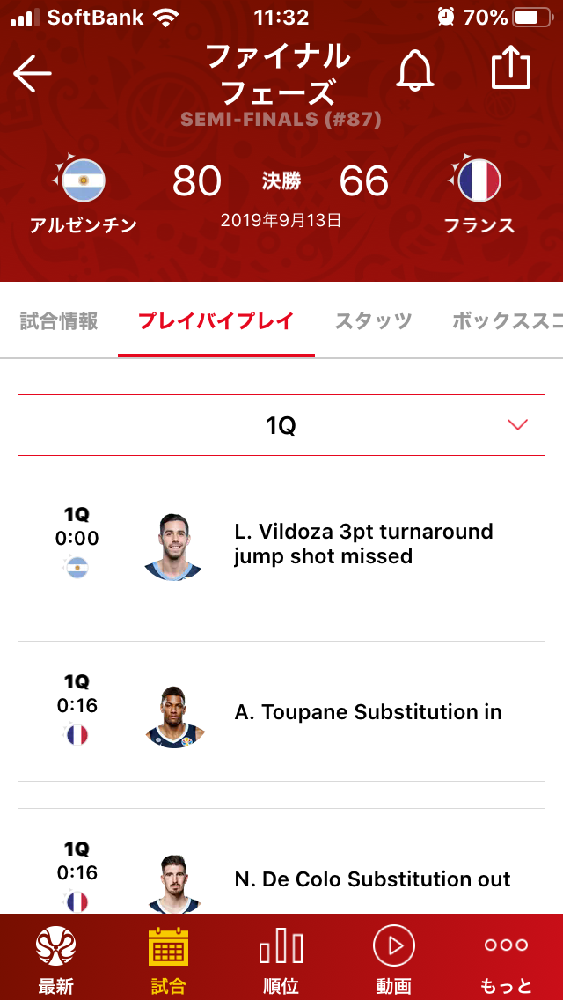
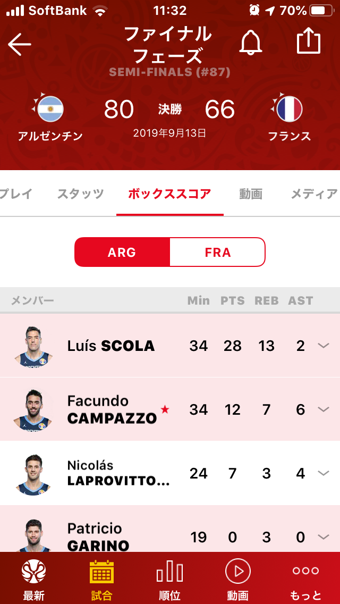
 

- FIBA2019 公式アプリが見やすく胸が熱くなった
- 楽しみ方の切り口として可能性を感じる

---

## フィクションでの盛り上がり

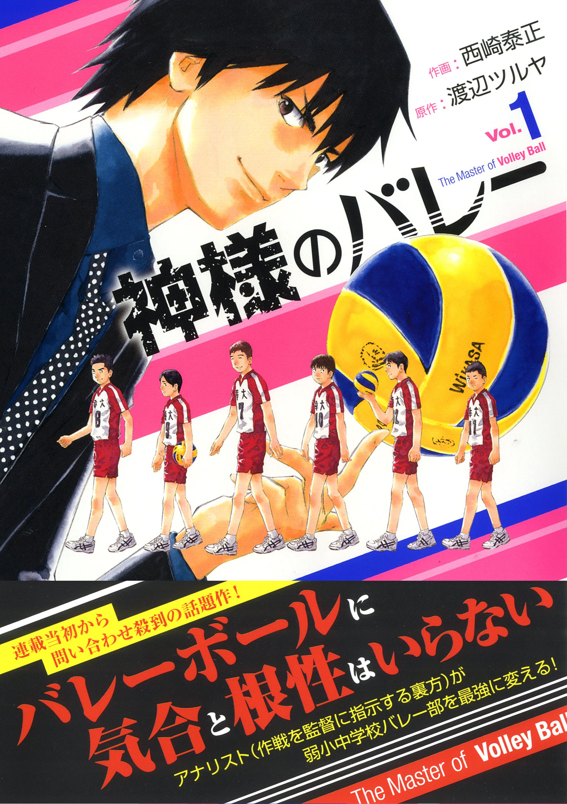
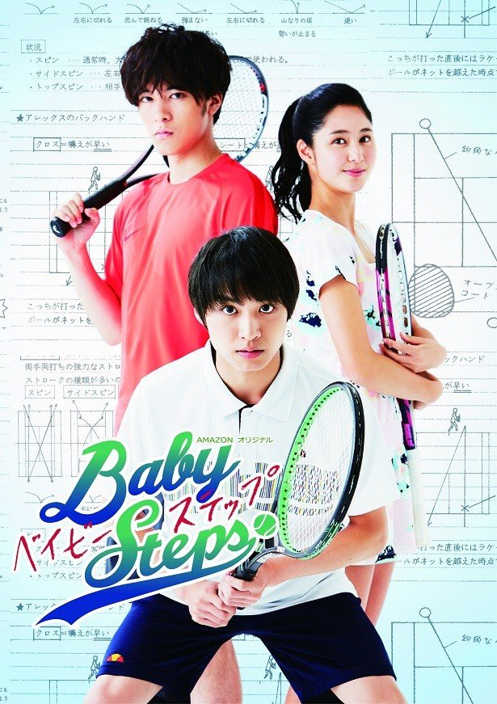
 

- 分析行為自身もエンタテイメントたりうる
- 「何となく凄そう」という程度でも楽しめる

---

## 2. 熱意

---

## 永続的コンテンツは魅力的

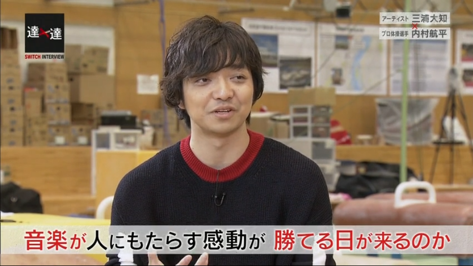
 

- 内村航平選手と三浦大知氏の対談が印象的 　　⇒ 音楽は刹那的娯楽と思うように

---

## 未来を作りたい

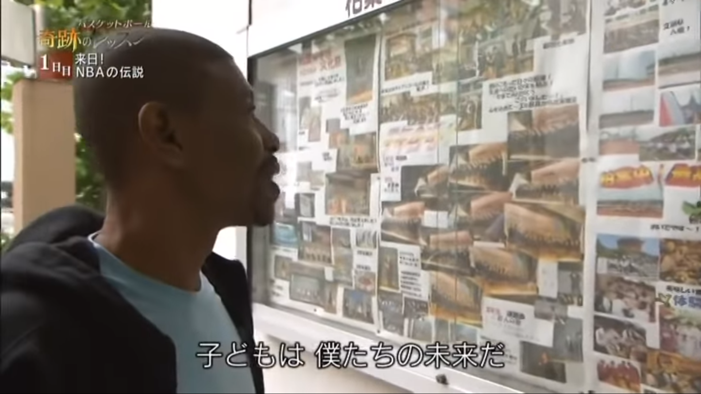
 

- Muggsy Bogues 氏『奇跡のレッスン』に感銘
    - スポーツは人を育てる
    - 人が未来をつくる

---

## 日本のバスケ・スポーツを
## 強くしたい

- 自分が生きている間に日本のバスケが強くなって欲しいと中高生の頃から妄想していた
- FIBA 2019 の結果が悔しすぎた
    - 競技レベル向上に貢献したくなった
- 『データ × 戦略』は世界で勝つために必須
    - 特に体格に左右されるスポーツ

---

## 3. スキルフィット

---

## ヒアリング力

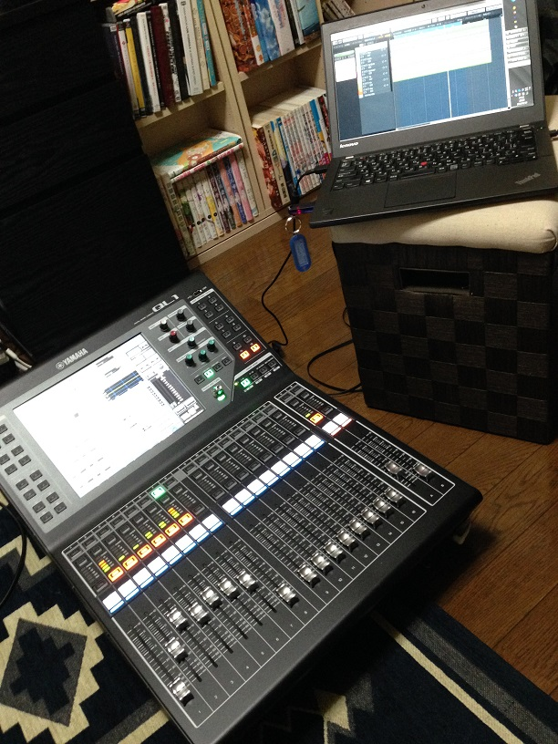
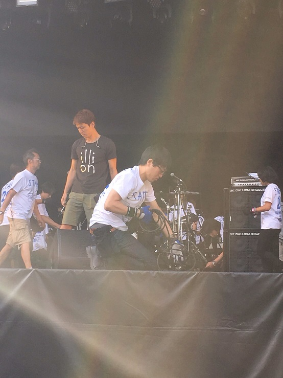
 

- ユーザーである専門家との会話経験多数
    - 自発的に専門家の基礎スキル習得へ
- 共感力には定評がある

---

## UI / UX 開発

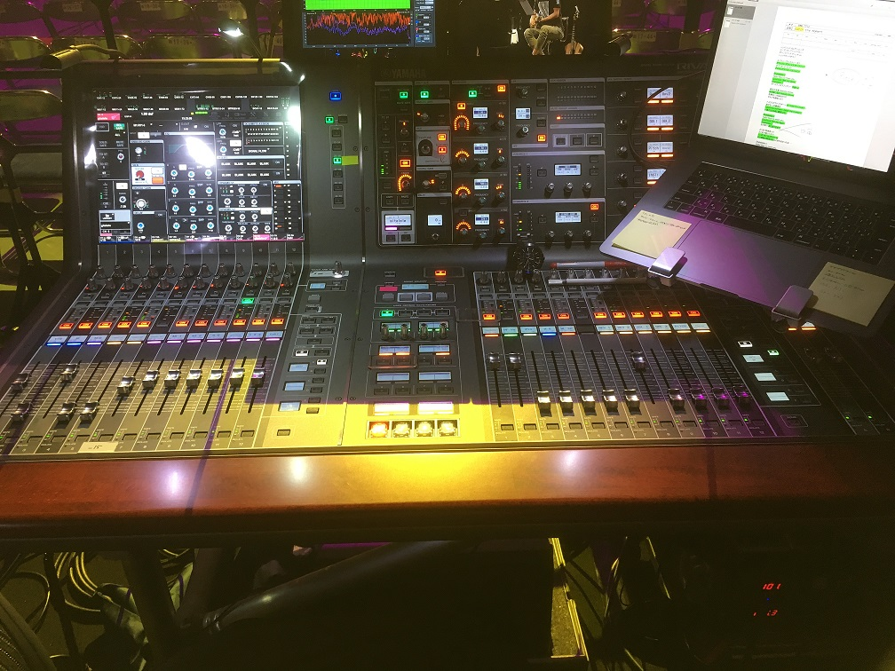
 

- 要求が厳しく仕様が複雑な音響製品の開発経験
- 汎用的なツールを作りスキルを高めたい

---

## キャッチアップ

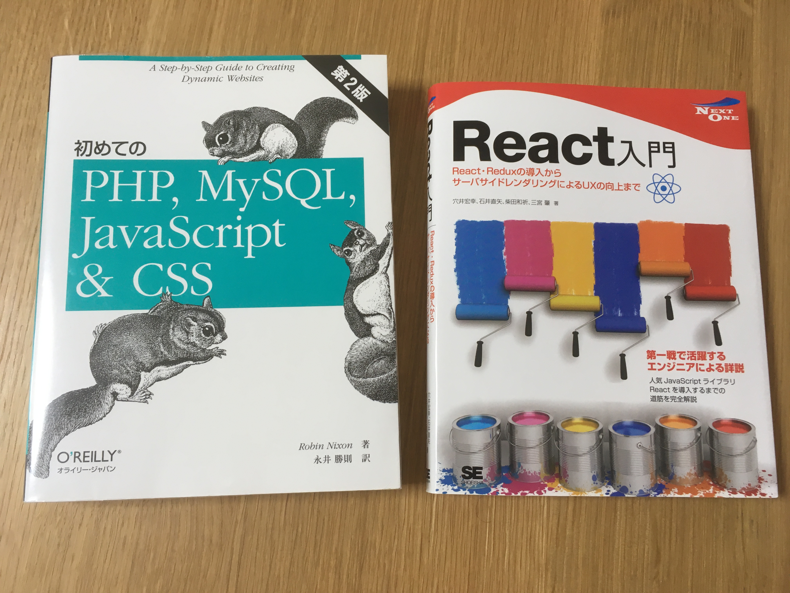
 

- MySQL, JavaScript, HTML, CSS は経験ある一方で React.js や PHP は未経験
    - 本を購入し自習開始
- 新スキル習得～実践は幾度と経験
